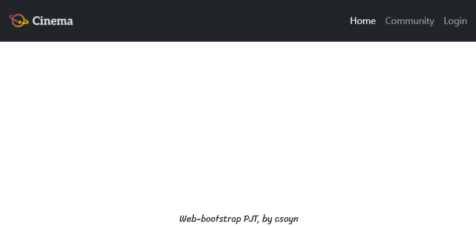
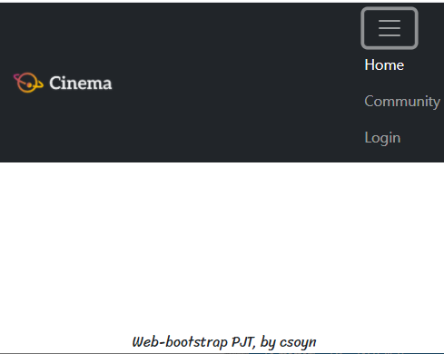
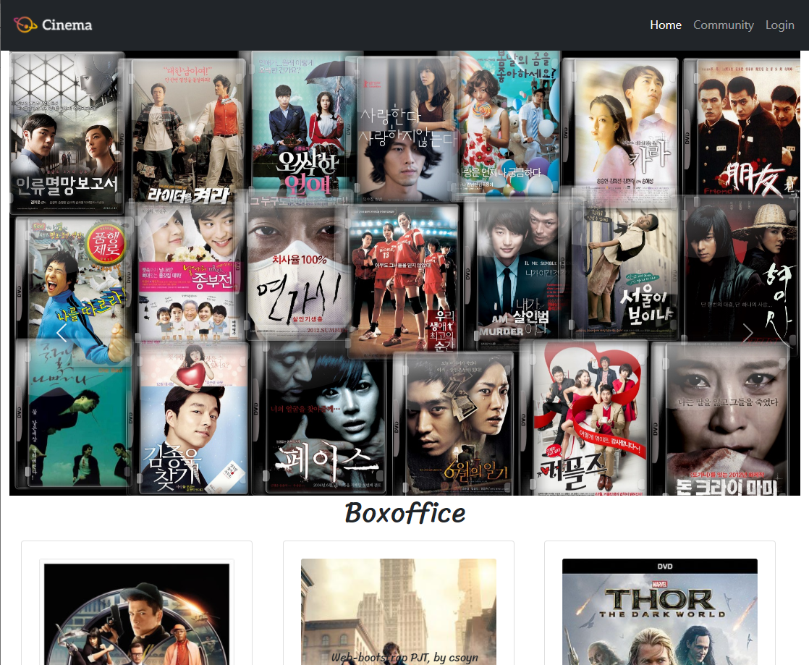
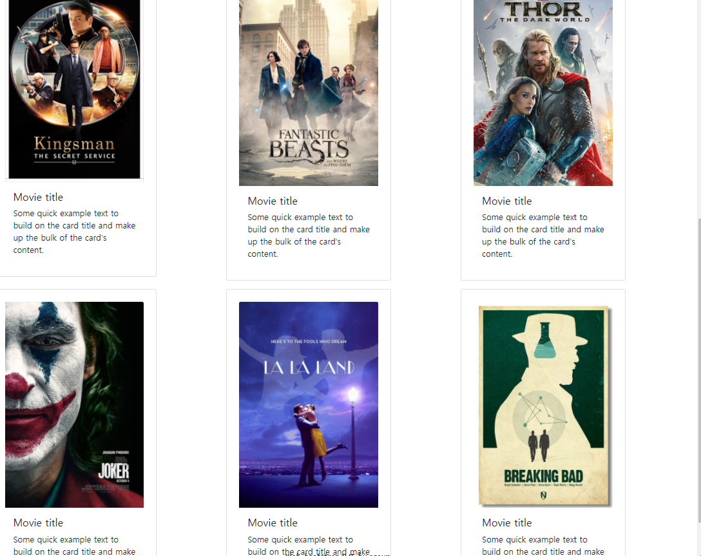
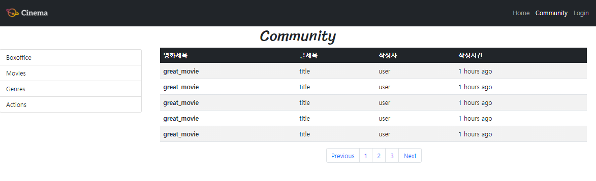
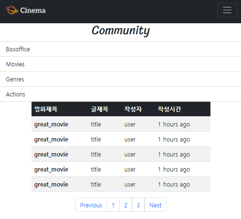

# Project3

> 반응형 웹 페이지 구성

## Problem_A 

> Navigation Bar

먼저, 결과화면 2개

**Review_A**

첫 화면 처럼, Home Community, Login과 로고이미지를 떨어트려 놓으려고 between을 썼다.

근데 화면을 줄였을 때 햄버거를 눌렀을 때도 쟤네들은 한 묶음이라 오른쪽에 있다..

end를 쓰면 햄버거 모양이 가운데로 오고,,,아주 awesome 했다......휴

시험공부를 하면서 놓친부분이 있었는지 확인해보고 다시 수정해야 겠다.!

### Problem_B

> 02_home

결과 화면.

**Review_B**

problem a,b,c 중에 제일 수월하게 할 수 있었던거 같다! 삼성 practice에서 했던 행-열 맟추기와

header사진 넘기기 carousel를 사용했다!

## Probelm-C

> 03_Community

결과화면,

**Review3**

쓰읍....단 list / table-striped / pagination을 사용하고!! 화면 너비에 따라 나타나는 거는 grid row, col,lg 써서 하긴 했는데... 알람같은거를 div 로 만들까 하다...쓰읍...

